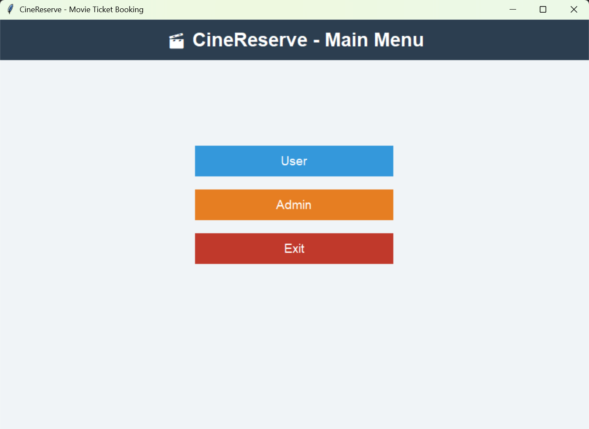
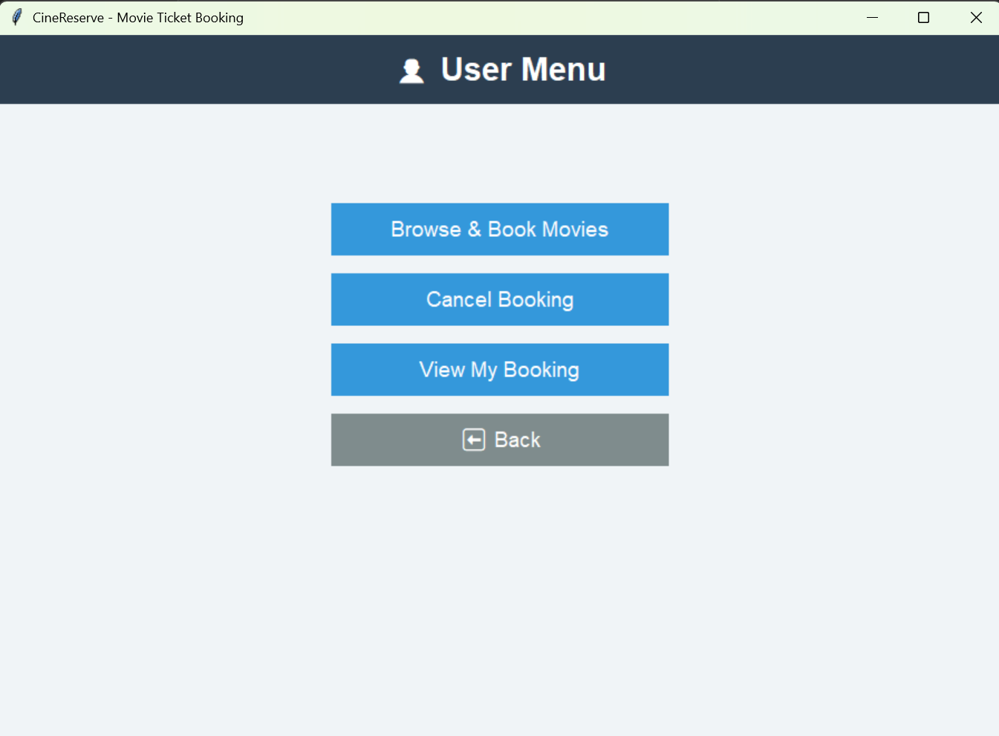
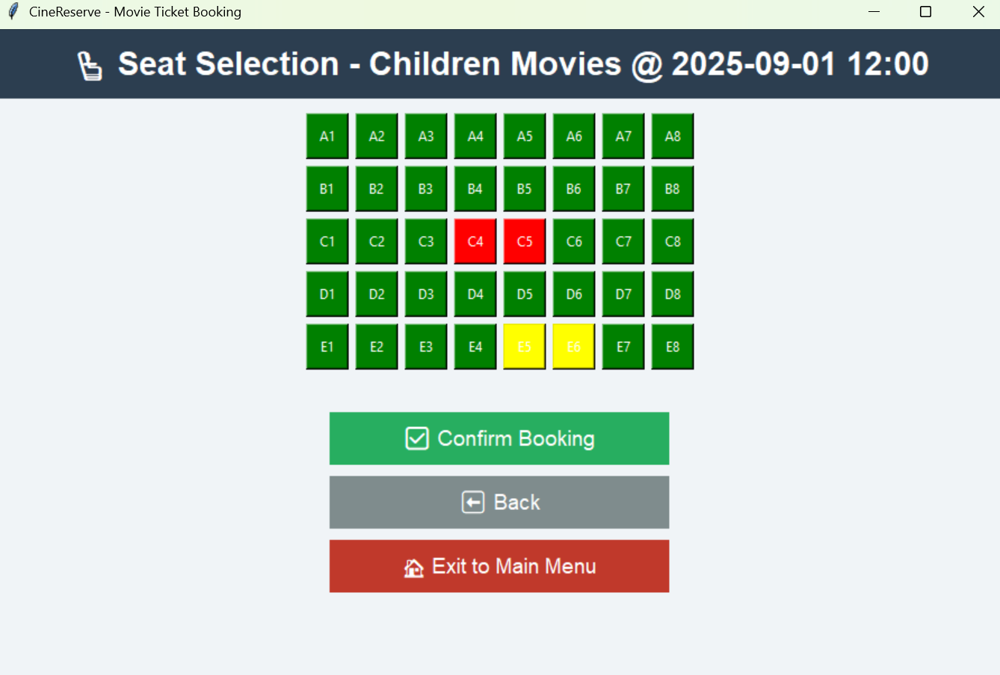
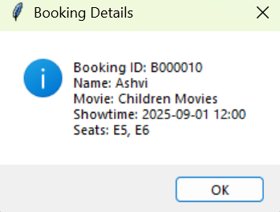
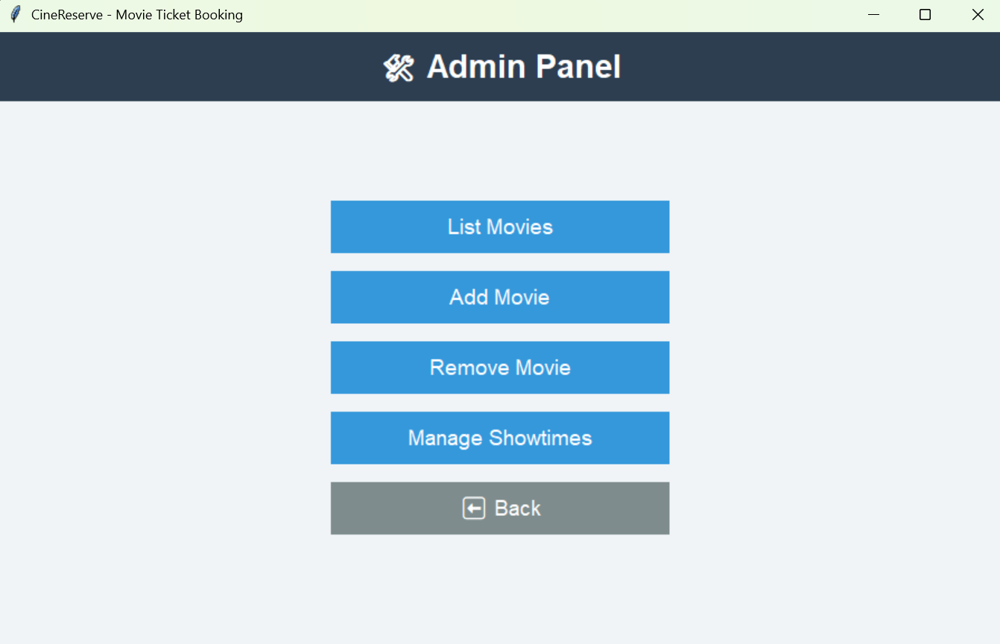
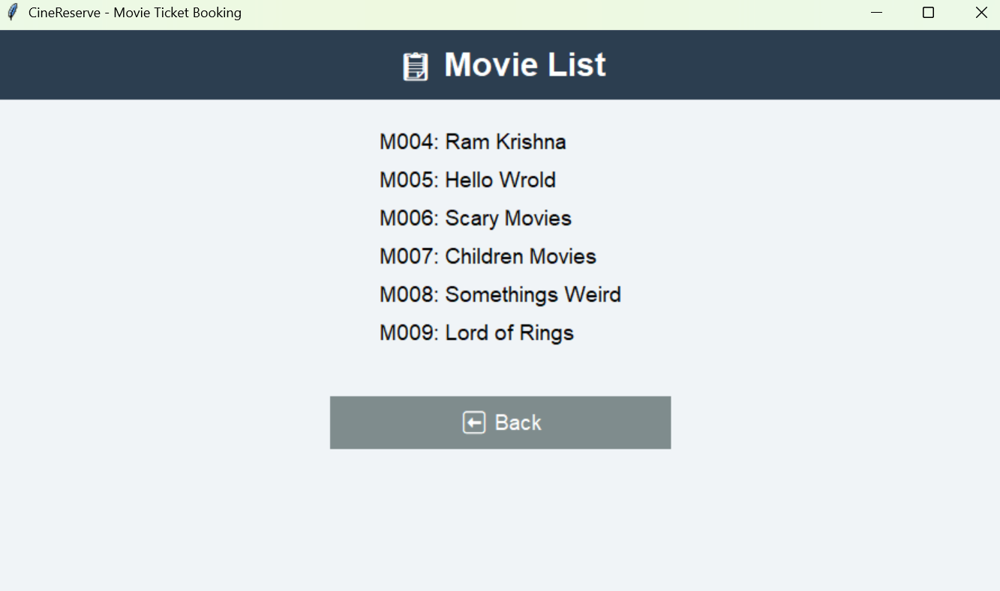
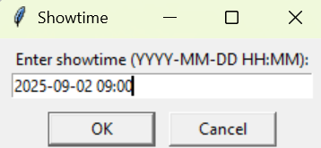
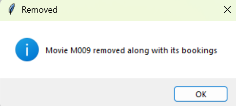

# CineReserve - Movie Ticket Booking System

CineReserve is a Python-based Movie Ticket Booking System with a Tkinter GUI.  
It allows users to browse movies, view showtimes, select seats, and manage their bookings.  
It also provides an admin panel for managing movies and showtimes.

## Features

### User
- Browse available movies  
- View showtimes  
- Book seats with live seat-map visualization  
- View existing bookings  
- Cancel bookings  

### Admin
- Secure login  
- Add and remove movies  
- Add and remove showtimes  
- Manage bookings linked to movies and showtimes 

## Screenshots
**Main Menu:**  

**User Menu:**  

**Browse Movies:**  

**Browse Movies:**  

**Showtimes:**  

**Seat Selection:**  

**Booking Confirmation:**  

**Admin Panel:**  

**Manage Movies:**  

**Showtimes:**

**Remove Movies:**

## Set Up and Installation

### Clone the Repository
git clone https://github.com/<your-username>/CineReserve.git
cd CineReserve

### Install Python
Make sure you have Python 3.8 or later installed.

Check your version:
python --version

### Install Required Libraries
CineReserve only uses standard Python libraries, so no extra pip installation is needed.
These libraries include:

-tkinter (GUI framework)
-json (data storage)
-datetime (timestamps)
-os (file handling & environment variables)

### Run the Application
From the project folder, run:
python gui.py

This will launch the CineReserve GUI, showing the Main Menu with User and Admin options.

### Admin Login
Default password: admin123

## Project Structure

CineReserve/
│── gui.py              # Main application (Tkinter GUI)
│── storage.json        # Local database for movies, showtimes, bookings
│── README.md           # Documentation
│── screenshots/        # Folder for screenshots
